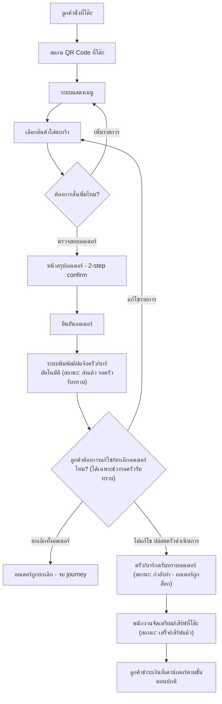

# User Journey — Self-Order (โต๊ะลูกค้า)

- **อัปเดตล่าสุด:** 2026-08-15
- **อ้างอิงโจทย์:** โจทย์ 1 — ผู้ประกอบการร้านกาแฟต้องการให้ลูกค้าสั่ง Order เองจากที่โต๊ะ
- **อ้างอิง Requirement:** [[../../01-requirements/01-spec/index|01-spec]]

## Diagram

## คำอธิบายตามลำดับ Diagram

1. **ลูกค้านั่งที่โต๊ะ** — จุดเริ่มต้นของ journey ก่อนมีระบบนี้ ลูกค้าต้องเรียกพนักงานมารับออเดอร์ตรงนี้ ระบบ self-order มีไว้แทนที่ขั้นตอนนั้น (อ้างอิง: [[../../01-requirements/01-spec/20260802-01-table-qr-self-order#ความต้องการ (Requirement)|ความต้องการ]])
2. **สแกน QR Code ที่โต๊ะ** — QR แต่ละอันผูกกับหมายเลขโต๊ะที่แน่นอน เพื่อให้ครัว/บาร์รู้ว่าออเดอร์มาจากโต๊ะไหน (อ้างอิง: [[../../01-requirements/01-spec/20260802-01-table-qr-self-order#Business Rules / เงื่อนไข|Business Rules]])
3. **ระบบแสดงเมนู** — ลูกค้าเปิดดูเมนูร้านกาแฟบนมือถือของตัวเอง (อ้างอิง: [[../../01-requirements/01-spec/20260802-01-table-qr-self-order#User Stories|User Story 1]])
4. **เลือกสินค้าใส่ตะกร้า** — เลือกรายการอาหาร/เครื่องดื่มแล้วเพิ่มลงตะกร้าออเดอร์ด้วยตัวเอง โดยไม่ต้องเรียกพนักงาน (อ้างอิง: [[../../01-requirements/01-spec/20260802-01-table-qr-self-order#User Stories|User Story 2]])
5. **ต้องการสั่งเพิ่มไหม?** — จุดตัดสินใจ ลูกค้าเลือกกลับไปเมนูเพื่อเพิ่มรายการต่อ หรือไปหน้าตรวจสอบออเดอร์ (อ้างอิง: [[../../01-requirements/01-spec/20260802-01-table-qr-self-order#ขอบเขต (Scope)|Scope — In scope]])
6. **หน้าสรุปออเดอร์ (2-step confirm)** — ให้ลูกค้าตรวจสอบความถูกต้องก่อนกดยืนยันจริง (อ้างอิง: [[../../01-requirements/01-spec/20260802-01-table-qr-self-order#User Stories|User Story 3]])
7. **ยืนยันออเดอร์** — ลูกค้ากดยืนยันครั้งที่สอง (อ้างอิง: [[../../01-requirements/01-spec/20260802-01-table-qr-self-order#Business Rules / เงื่อนไข|Business Rules — 2-step confirm]])
8. **ระบบพิมพ์สลิปแจ้งครัว/บาร์อัตโนมัติ (สถานะ: ส่งแล้ว รอครัวรับทราบ)** — ทันทีที่ลูกค้ายืนยันออเดอร์สำเร็จ ระบบพิมพ์สลิปออกที่เครื่องพิมพ์ในครัว/บาร์ทันที สลิปมีหมายเลขโต๊ะ เวลา และรายการอาหาร/เครื่องดื่ม พร้อมตั้งสถานะออเดอร์เป็น "ส่งแล้ว (รอครัวรับทราบ)" — แทนที่ node เดิม "ระบบส่งออเดอร์เข้าครัว/บาร์อัตโนมัติ" ที่คลุมเครือ (อ้างอิง: [[../../01-requirements/01-spec/20260815-01-kitchen-notification-order-handling#Business Rules / เงื่อนไข|Business Rules — การแจ้งเตือนครัว/บาร์]])
9. **ลูกค้าต้องการแก้ไข/ยกเลิกออเดอร์ไหม? (ได้เฉพาะช่วงรอครัวรับทราบ)** — จุดตัดสินใจใหม่ในสายหลัก (ไม่ใช่ exception) เพราะสเปกอนุญาตให้ลูกค้าแก้ไข/ยกเลิกเองได้ตราบใดที่ออเดอร์ยังอยู่ในสถานะ "ส่งแล้ว (รอครัวรับทราบ)" — เลือก "แก้ไขรายการ" จะวนกลับไปที่การเลือกสินค้าใส่ตะกร้า (node 4) แล้วผ่าน flow ยืนยันซ้ำอีกครั้ง, เลือก "ยกเลิกทั้งออเดอร์" จะจบ journey ทันที (node 13), หรือ "ไม่แก้ไข" ปล่อยให้ครัวดำเนินการต่อ (อ้างอิง: [[../../01-requirements/01-spec/20260815-01-kitchen-notification-order-handling#Business Rules / เงื่อนไข|Business Rules — การแก้ไข/ยกเลิกออเดอร์โดยลูกค้า]])
10. **ครัว/บาร์กดรับทราบออเดอร์ (สถานะ: กำลังทำ - ออเดอร์ถูกล็อก)** — พนักงานครัว/บาร์กดรับทราบ (เช่น กดปุ่มที่ POS หรือขีดสลิป) สถานะเปลี่ยนเป็น "ครัวรับทราบแล้ว (กำลังทำ)" และออเดอร์ถูกล็อก ลูกค้าไม่สามารถแก้ไข/ยกเลิกเองในระบบได้อีกหลังจุดนี้ — **หมายเหตุสำคัญ:** หากลูกค้าต้องการเปลี่ยนแปลงออเดอร์หลังจากจุดนี้ สเปกระบุว่าต้องเรียกพนักงานเป็นกรณีพิเศษ (exception path เท่านั้น ไม่ใช่ flow หลัก) — ไม่ได้นำมาวาดเป็น node ในรูป เพราะไม่ใช่ flow หลักตามสเปก และการเรียกพนักงานเพื่อจัดการออเดอร์ในลักษณะนี้เข้าข่ายกติกาที่ห้ามวาด node ที่มีความหมายเป็นการเรียกพนักงานมารับ/จัดการออเดอร์ในไดอะแกรมนี้ (อ้างอิง: [[../../01-requirements/01-spec/20260815-01-kitchen-notification-order-handling#Business Rules / เงื่อนไข|Business Rules — สถานะออเดอร์ และการแก้ไข/ยกเลิกออเดอร์โดยลูกค้า]])
11. **พนักงานจัดเตรียม/เสิร์ฟที่โต๊ะ (สถานะ: เสร็จ/เสิร์ฟแล้ว)** — จุดเดียวในระบบที่พนักงานเข้ามาเกี่ยวข้อง คือจัดเตรียม/เสิร์ฟเท่านั้น **ไม่ใช่การรับออเดอร์** สถานะออเดอร์เปลี่ยนเป็น "เสร็จ/เสิร์ฟแล้ว" (spec ระบุชัดว่าลูกค้าสั่งได้เองโดยไม่ต้องเรียกพนักงานมารับออเดอร์ที่โต๊ะ) (อ้างอิง: [[../../01-requirements/01-spec/20260815-01-kitchen-notification-order-handling#Business Rules / เงื่อนไข|Business Rules — สถานะออเดอร์]])
12. **ลูกค้าชำระเงินที่เคาน์เตอร์ตามขั้นตอนปกติ** — อยู่นอกขอบเขตของระบบดิจิทัลตาม spec นี้ (การชำระเงินไม่รวมอยู่ในขอบเขต ลูกค้ายังจ่ายที่เคาน์เตอร์ตามปกติของร้านหลังใช้บริการเสร็จ) ใส่ไว้เพื่อความสมบูรณ์ของ journey จริง ไม่ใช่ฟีเจอร์ที่ระบบต้องสร้าง (อ้างอิง: [[../../01-requirements/01-spec/20260802-01-table-qr-self-order#ขอบเขต (Scope)|Out of scope]])
13. **ออเดอร์ถูกยกเลิก - จบ journey** — สาขาปลายทางเมื่อลูกค้าเลือกยกเลิกทั้งออเดอร์ในขั้นตอนที่ 9 ขณะยังอยู่ในสถานะ "ส่งแล้ว (รอครัวรับทราบ)" (อ้างอิง: [[../../01-requirements/01-spec/20260815-01-kitchen-notification-order-handling#Business Rules / เงื่อนไข|Business Rules — การแก้ไข/ยกเลิกออเดอร์โดยลูกค้า]])

## Open Questions

- สเปก 20260815-01 ไม่ได้ระบุรายละเอียดว่าเมื่อลูกค้าเลือก "แก้ไขรายการ" (node 9) จะแก้ไขต่อจากตะกร้าเดิม หรือย้อนกลับไปเริ่มเลือกสินค้าใหม่ทั้งหมด — diagram นี้สมมติว่าวนกลับไปที่ node 4 (เลือกสินค้าใส่ตะกร้า) แล้วผ่าน flow ยืนยันซ้ำอีกครั้งตามปกติ ควรตรวจสอบกับสเปกที่ละเอียดกว่านี้ในอนาคต
- สเปกไม่ได้ระบุว่าเมื่อลูกค้า "ยกเลิกทั้งออเดอร์" (node 13) จะมีการแจ้งเตือนครัว/บาร์ (เช่น พิมพ์สลิปยกเลิก) หรือไม่ — diagram นี้สมมติว่า journey จบทันทีโดยไม่มีขั้นตอนเพิ่มเติมในระบบดิจิทัล
