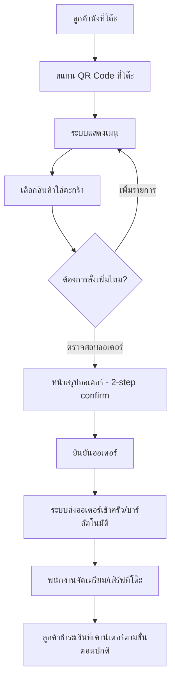

# User Journey — Self-Order (โต๊ะลูกค้า)

- **อัปเดตล่าสุด:** 2026-08-15
- **อ้างอิงโจทย์:** โจทย์ 1 — ผู้ประกอบการร้านกาแฟต้องการให้ลูกค้าสั่ง Order เองจากที่โต๊ะ
- **อ้างอิง Requirement:** [[../../01-requirements/01-spec/index|01-spec]]

## Diagram

## คำอธิบายตามลำดับ Diagram

1. **ลูกค้านั่งที่โต๊ะ** — จุดเริ่มต้นของ journey ก่อนมีระบบนี้ ลูกค้าต้องเรียกพนักงานมารับออเดอร์ตรงนี้ ระบบ self-order มีไว้แทนที่ขั้นตอนนั้น (อ้างอิง: [[../../01-requirements/01-spec/20260802-01-table-qr-self-order#ความต้องการ (Requirement)|ความต้องการ]])
2. **สแกน QR Code ที่โต๊ะ** — QR แต่ละอันผูกกับหมายเลขโต๊ะที่แน่นอน เพื่อให้ครัว/บาร์รู้ว่าออเดอร์มาจากโต๊ะไหน (อ้างอิง: [[../../01-requirements/01-spec/20260802-01-table-qr-self-order#Business Rules / เงื่อนไข|Business Rules]])
3. **ระบบแสดงเมนู** — ลูกค้าเปิดดูเมนูร้านกาแฟบนมือถือของตัวเอง (อ้างอิง: [[../../01-requirements/01-spec/20260802-01-table-qr-self-order#User Stories|User Story 1]])
4. **เลือกสินค้าใส่ตะกร้า** — เลือกรายการอาหาร/เครื่องดื่มแล้วเพิ่มลงตะกร้าออเดอร์ด้วยตัวเอง โดยไม่ต้องเรียกพนักงาน (อ้างอิง: [[../../01-requirements/01-spec/20260802-01-table-qr-self-order#User Stories|User Story 2]])
5. **ต้องการสั่งเพิ่มไหม?** — จุดตัดสินใจ ลูกค้าเลือกกลับไปเมนูเพื่อเพิ่มรายการต่อ หรือไปหน้าตรวจสอบออเดอร์ (อ้างอิง: [[../../01-requirements/01-spec/20260802-01-table-qr-self-order#ขอบเขต (Scope)|Scope — In scope]])
6. **หน้าสรุปออเดอร์ (2-step confirm)** — ให้ลูกค้าตรวจสอบความถูกต้องก่อนกดยืนยันจริง (อ้างอิง: [[../../01-requirements/01-spec/20260802-01-table-qr-self-order#User Stories|User Story 3]])
7. **ยืนยันออเดอร์** — ลูกค้ากดยืนยันครั้งที่สอง (อ้างอิง: [[../../01-requirements/01-spec/20260802-01-table-qr-self-order#Business Rules / เงื่อนไข|Business Rules — 2-step confirm]])
8. **ระบบส่งออเดอร์เข้าครัว/บาร์อัตโนมัติ** — ส่งทันทีโดยไม่ผ่านการตรวจสอบจากพนักงานก่อน (อ้างอิง: [[../../01-requirements/01-spec/20260802-01-table-qr-self-order#User Stories|User Story 4]])
9. **พนักงานจัดเตรียม/เสิร์ฟที่โต๊ะ** — จุดเดียวในระบบที่พนักงานเข้ามาเกี่ยวข้อง คือจัดเตรียม/เสิร์ฟเท่านั้น **ไม่ใช่การรับออเดอร์** (spec ระบุชัดว่าลูกค้าสั่งได้เองโดยไม่ต้องเรียกพนักงานมารับออเดอร์ที่โต๊ะ) (อ้างอิง: [[../../01-requirements/01-spec/20260802-01-table-qr-self-order#ความต้องการ (Requirement)|ความต้องการ]])
10. **ลูกค้าชำระเงินที่เคาน์เตอร์ตามขั้นตอนปกติ** — อยู่นอกขอบเขตของระบบดิจิทัลตาม spec นี้ (การชำระเงินไม่รวมอยู่ในขอบเขต ลูกค้ายังจ่ายที่เคาน์เตอร์ตามปกติของร้านหลังใช้บริการเสร็จ) ใส่ไว้เพื่อความสมบูรณ์ของ journey จริง ไม่ใช่ฟีเจอร์ที่ระบบต้องสร้าง (อ้างอิง: [[../../01-requirements/01-spec/20260802-01-table-qr-self-order#ขอบเขต (Scope)|Out of scope]])

## Open Questions

- ไม่มี — ทุกขั้นตอนใน diagram นี้มี spec ([[../../01-requirements/01-spec/20260802-01-table-qr-self-order|20260802-01-table-qr-self-order]]) รองรับครบแล้ว
